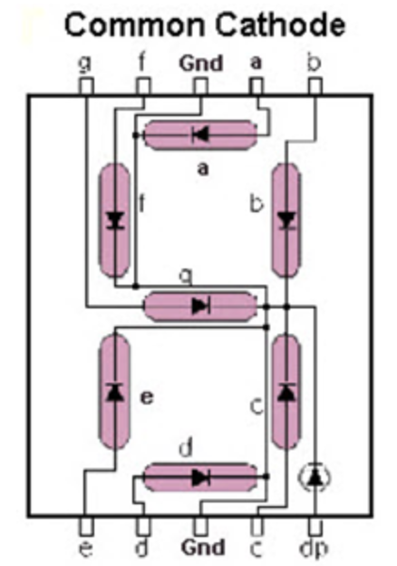

# 4D-touchSensor-7SegmentDisplay
The ideia is to use a 4 digit touch sensor and output what the user has pressed into the 7 segment display.

## Hardware used 

I'll use the MSP430FR2355 from texas instruments. Therefore, the goal is to document all steps followed to create this project.

## Documentation

References used in this project:
- SLAU445I–October 2014–Revised March 2019
- MSP430FR2355 datasheet

## Steps

### 7 Segment Display programming

I'll use the 7 segment display HS-5101AS to the project. Pay attention to what kind of display are you using. This display is cathode kind. As a result, both pins in the middle at the top and at the bottom are GND.

<div style="text-align:center">
    
</div>

Since we need to use to 7 pins we will be using prins P2.5, P2.4, P3.7, P6.4, P6.3, P6.2 and P6.1

To configure the pins, just look at the pages 93 through 103 in the datasheet. 

```
void configPins(){
    /* Configuration */

    // --- PINs ----

    //P2.5 --> out (a)
    P2DIR |= BIT5;
    P2OUT &= ~BIT5;

    //P2.4 --> out (b)
    P2DIR |= BIT4;
    P2OUT &= ~BIT4;

    //P3.7 --> out (c)
    P3DIR |= BIT7;
    P3OUT &= ~BIT7;

    //P6.4 --> out (d)
    P6DIR |= BIT4;
    P6OUT &= ~BIT4;

    //P6.3 --> out (e)
    P6DIR |= BIT3;
    P6OUT &= ~BIT3;

    //P6.2 --> out (f)
    P6DIR |= BIT2;
    P6OUT &= ~BIT2;

    //P6.1 --> out (g)
    P6DIR |= BIT1;
    P6OUT &= ~BIT1;

}
```


### 4D Touch Sensor Programming 

The configuration of the pins need to be:
- INPUT 
- REN = 0, because we need to enable pull-up and pull-down resistors
- PxOUT = 0, because we need to choose pull-down resistor, since the sensor will output 1 when any number is pressed. 

```
void configPins4D(){
    /* Configuration */

    // --- PINs ----

    //P4.5 --> in (1)
    P4DIR &= ~BIT5;
    P4REN |= BIT5;
    P4OUT &= ~BIT5;

    //P5.2 --> in (2)
    P5DIR &= ~BIT2;
    P5REN |= BIT2;
    P5OUT &= ~BIT2;

    //P5.4 --> in (3)
    P5DIR &= ~BIT4;
    P5REN |= BIT4;
    P5OUT &= ~BIT4;

    //P5.0 --> in (4)
    P5DIR &= ~BIT0;
    P5REN |= BIT0;
    P5OUT &= ~BIT0;

}
```

### General Logic

The number you press on the sensor will output the same number on the 7 segment display.

```
    while(1){
	    while(!(P4IN & BIT5) && !(P5IN & BIT2) && !(P5IN & BIT4) && !(P5IN & BIT0));
        if( (P4IN & BIT5) ){
            turnOnNumber(1);
        } else if( (P5IN & BIT2) ){
            turnOnNumber(2);
        } else if( (P5IN & BIT4) ){
            turnOnNumber(3);
        } else if( (P5IN & BIT0) ){
            turnOnNumber(4);
        } else {
            turnOnNumber(0);
        }
	}
```